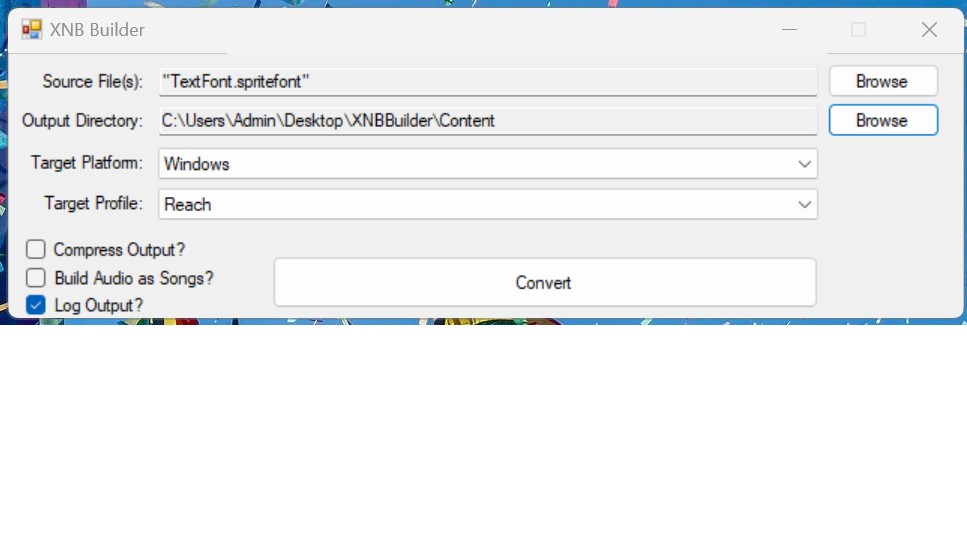
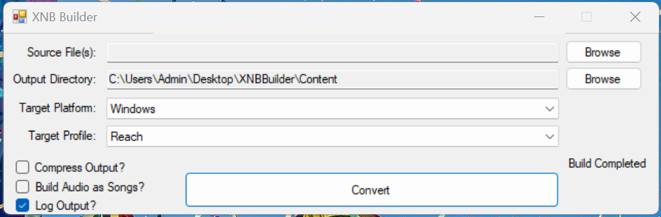

# XNBBuilder

## About (Idea)
Create .xnb files for use in XNA games. This allows for .png to .xnb and more.

## Screenshots

## Format Details
* Full list of supported filetypes:
- Graphics Files: *.bmp;*.dds;*.dib;*.hdr;*.jpg;*.pfm;*.png;*.ppm;*.tga
- Autodesk FBX Files: *.fbx
- Effects Files: *.fx
- SpriteFont Files: *.spritefont
- X Files: *.x
- XNA XML Files: *.xml
- Audio Files: *.mp3;*.wav;*.wma
- Video Files: *.wmv

## Progress
Recently updated to fix an error where content would never be compressed. 
You should update to the latest version in order to fix this.

## Caution / Warning 

I tried to decomp. xna dlls to fulfill "full app autonomics" (or "dll singularity", heh) ! The result: epic fail , the XNA Pipeline src code is so huge... ;(

So, the *full version* of XNA Game Studio (GS) is *required* for conversion! 
Please install XNA GS special edition that located at XnaForVS2022 folder (zipped XnaForVS2022.zip file can be found at Releases zone). 

To do whole setup process of GS, you need to perform *all steps* 1-5 
(see XnaForVS2022/README.TXT included , for details) .

## Additional Info
- Support for some filetypes may be incomplete, graphics filetypes should all be fine. 
- If there's an issue with converting a certain filetype, please let me know!

## References
https://sourceforge.net/projects/xnbbuilder/ XNB Builder "Web Storage" 

## ..
As is. No support. RnD only.

## .
[m][e] 2023